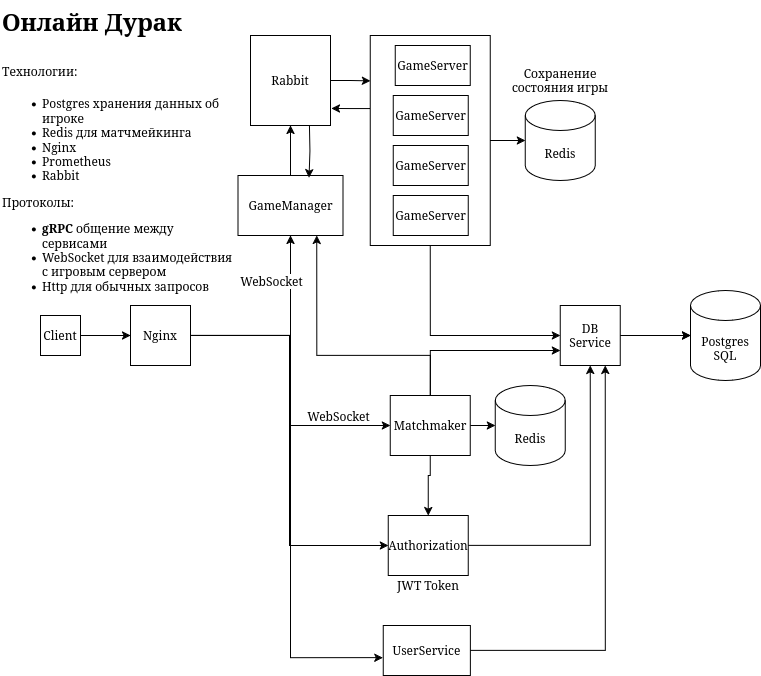
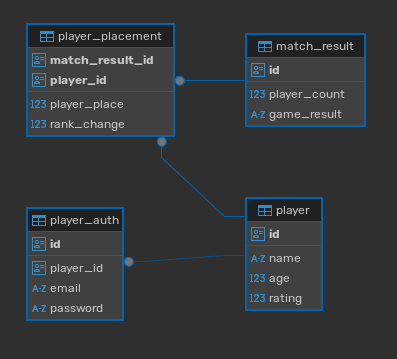

# MicroDurak

Микросервисная платформа для онлайн-игры в дурака.

## Архитектура

Проект состоит из пяти основных сервисов:

- **auth** — сервис аутентификации и регистрации (JWT, SMTP)
- **players** — управление игроками и рейтингом (gRPC + HTTP)
- **game** — игровой движок (WebSocket через RabbitMQ)
- **game-manager** — управление игровыми сессиями и сообщениями
- **matchmaker** — подбор соперников для матчей



### Схема базы данных



## Технологический стек

- **Язык:** Go 1.24.1
- **База данных:** PostgreSQL 17
- **Кеш/Очередь:** Redis 7, RabbitMQ 3.13
- **API:** gRPC, REST (Echo), WebSocket
- **Мониторинг:** Prometheus, Grafana
- **Документация:** Swagger
- **Оркестрация:** Kubernetes, Docker Compose

## Быстрый старт

### Предварительные требования

- Go 1.24+
- Docker & Docker Compose
- Make

### Запуск через Docker Compose

1. Создайте файл `.env` с необходимыми переменными окружения
2. Запустите все сервисы:

```bash
docker-compose up -d
```